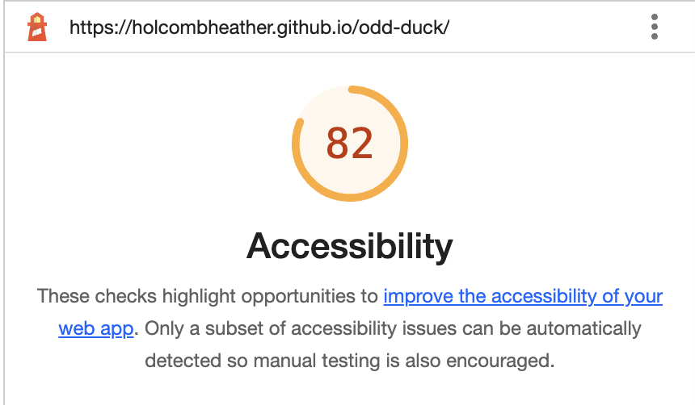
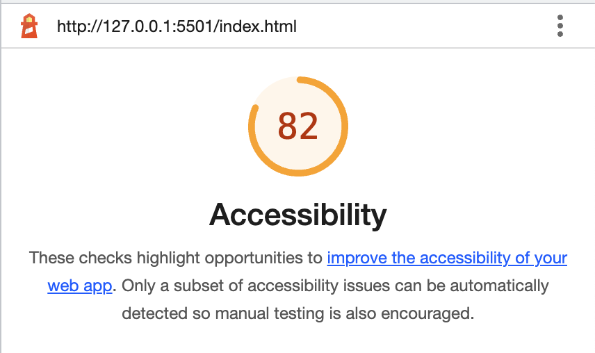

# Lab 11

## odd-duck
Web app to track votes for new product investment

### Author: Heather Holcomb | Code-201d98

### Links and References

Lab 11
- Heavily referenced document from class demo (https://github.com/codefellows/seattle-code-201d98/tree/main/class-11/demo)
- https://www.w3schools.com/jsref/met_element_addeventlistener.asp 
- https://developer.mozilla.org/en-US/docs/Web/API/EventTarget/addEventListener
- https://stackoverflow.com/questions/13831601/disabling-and-enabling-a-html-input-button 

Lab 12
- Class demo
- https://developer.mozilla.org/en-US/docs/Web/JavaScript/Reference/Global_Objects/Array/slice 
- https://webtechparadise.com/article/understanding-slice-method-javascript-basics-negative-indexing-and-concept-shallow-copy/17
- https://www.chartjs.org/docs/latest/getting-started/

### Lighthouse Accessiblity Report: 

Report for Lab 11:
 

Report for Lab 12:
